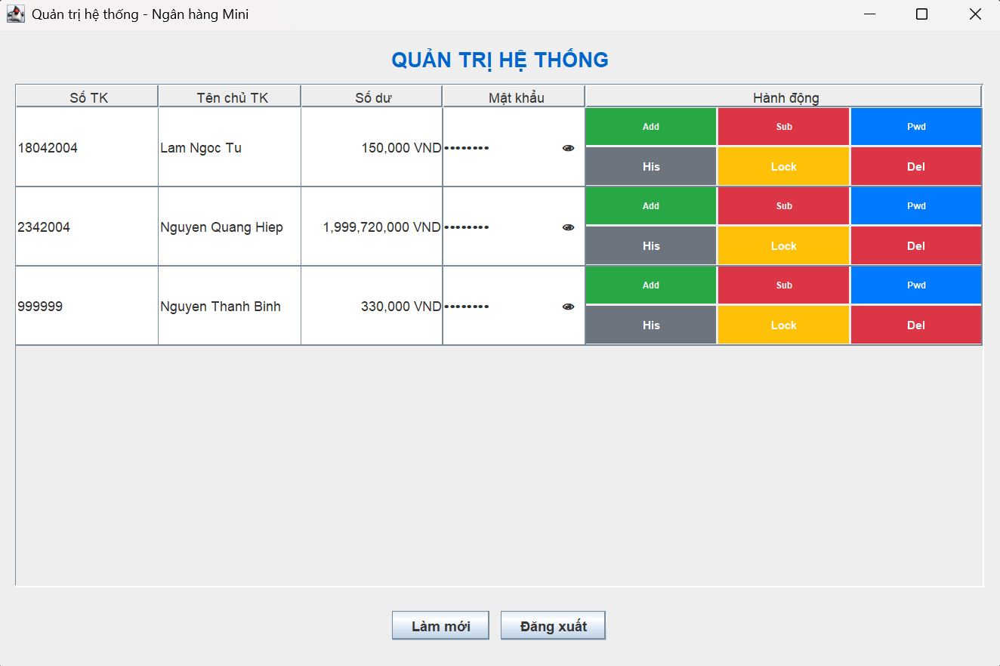
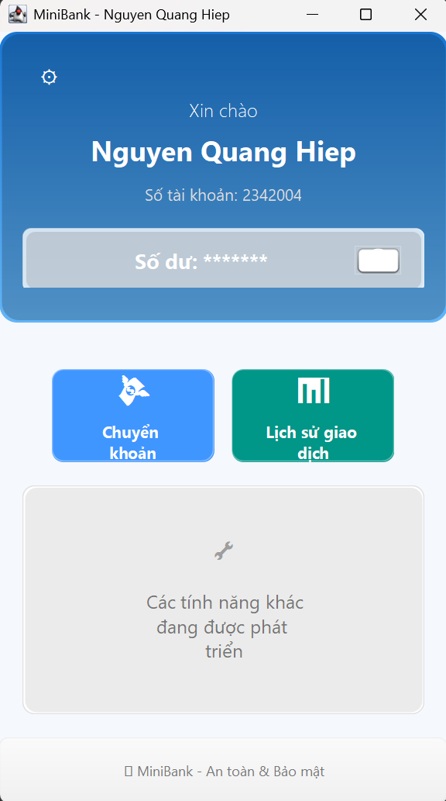
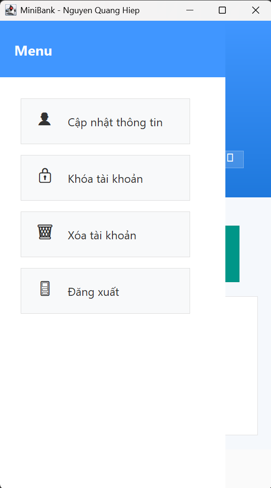
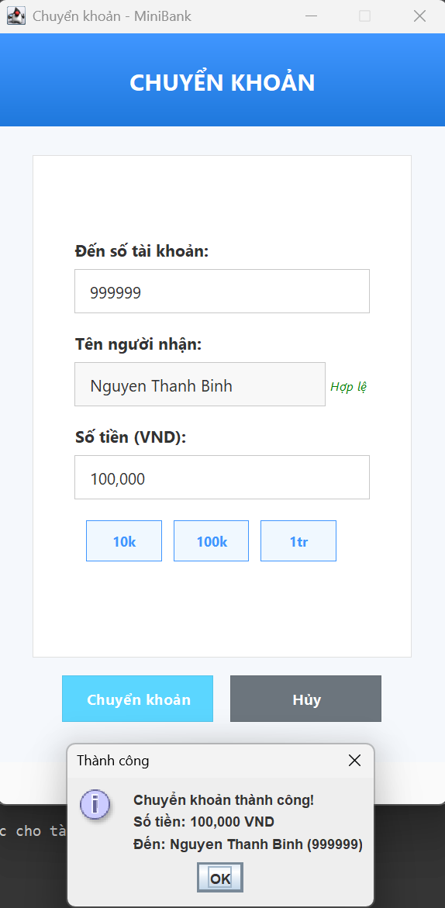
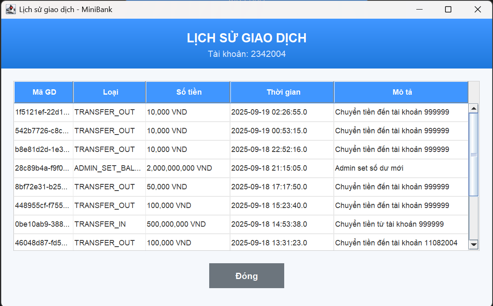
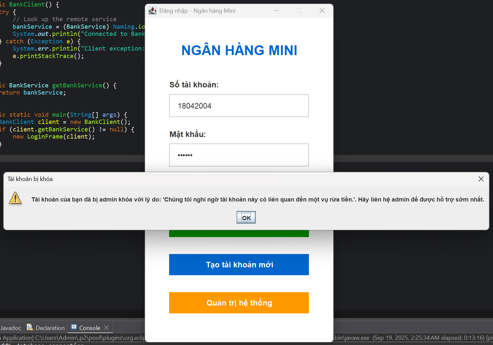

<h2 align="center">
    <a href="https://dainam.edu.vn/vi/khoa-cong-nghe-thong-tin">
    �  FACULTY OF INFORMATION TECHNOLOGY (DAINAM UNIVERSITY)
    </a>
</h2>
<h2 align="center">
    HỆ THỐNG QUẢN LÝ NGÂN HÀNG MINI - RMI
</h2>

<div align="center">
    <p align="center">
        
        
        
    </p>

[](https://www.facebook.com/DNUAIoTLab)
[](https://dainam.edu.vn/vi/khoa-cong-nghe-thong-tin)
[](https://dainam.edu.vn)

</div>

---

## 📖 1. Giới thiệu hệ thống
Hệ thống **Quản lý Ngân hàng Mini** được xây dựng theo mô hình **client-server** sử dụng **Java RMI** nhằm:
- Hỗ trợ khách hàng đăng nhập, tạo tài khoản, kiểm tra số dư, chuyển tiền và xem lịch sử giao dịch.
- Cho phép quản trị viên (Admin) quản lý tài khoản, khóa/mở khóa tài khoản, thiết lập số dư và theo dõi toàn bộ hệ thống.
- Cung cấp giao diện người dùng hiện đại, thân thiện và đầy đủ tính năng, phục vụ nhu cầu quản lý ngân hàng nhỏ.

✨ Các chức năng chính:
- **Đăng nhập/Tạo tài khoản** khách hàng mới.
- **Server**: quản lý tài khoản, xử lý giao dịch, theo dõi số dư, lưu trữ lịch sử giao dịch.
- **Client**: kiểm tra số dư, chuyển tiền, xem lịch sử, khóa tài khoản.
- **Lưu trữ**: dữ liệu được lưu trữ trong cơ sở dữ liệu **MySQL**, đảm bảo tính bền vững và an toàn.

🎯 Mục tiêu hệ thống:
- Số hóa ngân hàng: thay thế phương pháp quản lý thủ công bằng một hệ thống trực tuyến, dễ sử dụng và hiện đại.
- Tối ưu trải nghiệm người dùng: hỗ trợ giao diện trực quan, xử lý giao dịch nhanh chóng, theo dõi số dư realtime.
- Hỗ trợ quản trị viên (Admin): dễ dàng quản lý tài khoản, thiết lập số dư, khóa/mở khóa tài khoản, giám sát hoạt động giao dịch.  

## 🔧 2. Các công nghệ được sử dụng
- **Ngôn ngữ:** Java
- **Giao diện:** Java Swing
- **Giao thức mạng:** Java RMI (Remote Method Invocation) 
- **Lưu trữ:** MySQL Database
- **Môi trường phát triển:** Eclipse IDE
- **Hệ điều hành:** Windows

<div align="center">

[](https://www.java.com/)
[](#)
[](#)
[](#)
[](https://www.eclipse.org/)
[](https://www.microsoft.com/windows)

</div>

## 📷 3. Một số hình ảnh
<p align="center">
<p align="center">
  <br/>
  <i>Hình 1: Giao diện "Đăng nhập"</i>
</p>
<br/>
<p align="center">
  <br/>
  <i>Hình 2: Giao diện "Đăng ký"</i>
</p>
<br/>
<p align="center">
  <br/>
  <i>Hình 3: Giao diện quản lý tài khoản của Admin</i>
</p>
<br/>
<p align="center">
  <br/>
  <i>Hình 4: Giao diện chính</i>
</p>
<br/>
<p align="center">
  <br/>
  <i>Hình 5: Giao diện Menu</i>
</p>
<br/>
<p align="center">
  <br/>
  <i>Hình 6: Giao diện "Chuyển khoản"</i>
</p>
<br/>
<p align="center">
  <br/>
  <i>Hình 7: Giao diện "Lịch sử giao dịch"</i>
</p>
<br/>
<p align="center">
  <br/>
  <i>Hình 8: Tài khoản bị khóa</i>
</p>
</p>

## ⚙️ 4. Các bước cài đặt & sử dụng

### 1️⃣ Chuẩn bị môi trường
- Cài đặt **Java JDK 8+** → [Tải tại đây](https://www.oracle.com/java/technologies/javase-downloads.html)  
- Cài đặt **MySQL Server** → [Tải tại đây](https://dev.mysql.com/downloads/mysql/)  
- Cài đặt **Eclipse IDE** → [Tải tại đây](https://www.eclipse.org/downloads/)  
- Hệ điều hành: **Windows 10/11**.  

### 2️⃣ Tải source code
- Clone dự án từ GitHub:  
git clone https://github.com/your-username/QuanLyNganHangMini.git
- Hoặc tải file `.zip` → giải nén.  

### 3️⃣ Import dự án vào IDE
- Mở **Eclipse IDE** → `File` → `Import` → `Existing Projects into Workspace`.  
- Chọn thư mục dự án vừa tải về.  
- Kiểm tra `Project → Properties → Java Build Path` để chắc chắn JDK đã được cấu hình đúng.  

### 4️⃣ Cấu hình cơ sở dữ liệu
- Tạo database **bank_mini** trong MySQL:  
```sql
CREATE DATABASE bank_management;
USE bank_management;

-- Tạo bảng accounts
CREATE TABLE accounts (
    account_number VARCHAR(20) PRIMARY KEY,
    account_holder VARCHAR(100) NOT NULL,
    balance DOUBLE NOT NULL DEFAULT 0,
    password VARCHAR(100) NOT NULL,
    created_at TIMESTAMP DEFAULT CURRENT_TIMESTAMP,
    updated_at TIMESTAMP DEFAULT CURRENT_TIMESTAMP ON UPDATE CURRENT_TIMESTAMP
);

-- Tạo bảng transactions
CREATE TABLE transactions (
    transaction_id VARCHAR(50) PRIMARY KEY,
    account_number VARCHAR(20) NOT NULL,
    type VARCHAR(20) NOT NULL,
    amount DOUBLE NOT NULL,
    timestamp DATETIME NOT NULL,
    description VARCHAR(255),
    created_at TIMESTAMP DEFAULT CURRENT_TIMESTAMP,
    FOREIGN KEY (account_number) REFERENCES accounts(account_number) ON DELETE CASCADE
);

-- Tạo index để tăng tốc độ query
CREATE INDEX idx_account_number ON accounts(account_number);
CREATE INDEX idx_transactions_account ON transactions(account_number);
CREATE INDEX idx_transactions_timestamp ON transactions(timestamp);

-- Thêm dữ liệu mẫu
INSERT INTO accounts (account_number, account_holder, balance, password) VALUES
('2342004', 'Nguyen Quang Hiep', 1000000, '230404'),
```
- Cập nhật thông tin kết nối trong `DatabaseConnection.java`:  
  username|password|host|database_name

> 📌 Lưu ý: File này được server đọc & ghi trực tiếp. Khi chuyển tiền, dữ liệu sẽ tự động cập nhật.

### 5️⃣ Chạy chương trình
- **Khởi động Server**  
  - Mở file `BankServer.java` → Run.  
  - Server sẽ hiển thị log RMI Registry và quản lý kết nối database.  

- **Khởi động Client**  
  - Mở file `BankClient.java` → Run.  
  - Cửa sổ giao diện hiện ra cho phép đăng nhập, chuyển tiền, kiểm tra số dư từ xa.  

### 6️⃣ Đăng nhập / Tạo tài khoản
- **Đăng nhập**: Sử dụng số tài khoản và mật khẩu đã tạo.  
- **Tạo tài khoản**: Nhấn nút **Tạo tài khoản mới** trên Client để đăng ký.  

### 7️⃣ Thao tác chính trên hệ thống
- **Kiểm tra số dư** → nhấn biểu tượng mắt để hiện/ẩn số dư.  
- **Chuyển tiền** → nhập số tài khoản đích → số tiền → xác nhận.  
- **Xem lịch sử giao dịch** → hiển thị tất cả giao dịch đã thực hiện.  
- **Khóa tài khoản** → tự khóa tài khoản khi cần thiết.  
- **Admin** → quản lý tài khoản, thiết lập số dư, khóa/mở tài khoản.  

### 8️⃣ Tài khoản demo (mặc định)
Ví dụ trong database:  
2342004|230404|Nguyễn Quang Hiệp

### 9️⃣ Kết thúc phiên làm việc
- Đóng cửa sổ **Client** để thoát.  
- Dừng **Server** (Stop trong Eclipse) → dữ liệu đã được lưu lại vào database.  


✅ Sau khi hoàn tất các bước trên, bạn đã có thể sử dụng hệ thống **Quản lý ngân hàng mini** với đầy đủ tính năng đăng nhập, chuyển tiền, kiểm tra số dư qua Java RMI.

## ✉️ 5. Liên hệ (cá nhân)
Nếu bạn cần trao đổi thêm hoặc muốn phát triển mở rộng hệ thống, vui lòng liên hệ:  

- 👨‍💻 **Tác giả:** [Nguyễn Quang Hiệp]  
- 📧 **Email:** [quanghiep2342004@gmail.com]  
- 📱 **SĐT:** [0396259480]  
- 🌐 **GitHub:** [github.com/NguyenQuangHiep234]  
<br/>
© 2025 AIoTLab, Faculty of Information Technology, DaiNam University. All rights reserved.
